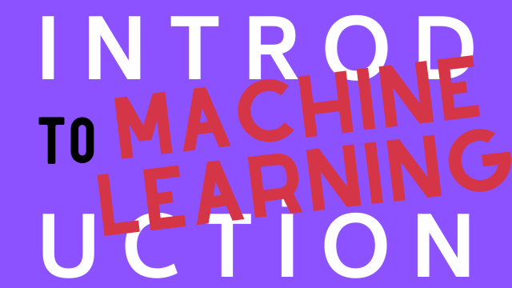

# announcements
You can find latest course annoucements etc. some text will be added

## Courses
|Python|Artificial Intelligence|Machine Learning|
|-|-|-|
||||

## Update
#### 15.04.2021
- Next [Introduction to Python](https://github.com/gaih/announcements/blob/main/introduction-to-python.md) course will be DD:MM:YYYY, sign up education with this [link](globalaihub.com)! 

#### 12.04.2021
- New course released **Introduction to Hyperautomation and RPA.** Enroll this course today on [Global AI Hub](globalaihub.com/education) 

## Hatirlaticilar
### Katilim Formu
Sertifika almaya sorunsuz bir şekilde hak kazanabilmeniz için kurs süresi içerisinde katılım formunu doldurduğunuzdan lütfen emin olun. Katılım formu sadece kursun **canlı olarak yapıldığı süre boyunca aktif olacaktır!**

Lütfen katılım formunu doldururken sertifikanızın üzerinde görmek istediğiniz **adınızı ve soyadınızı** yazınız. Katılım formunu doldururken **aynı e-posta adresini** kullanmaya dikkat ediniz.

### Sertifika 
Sertifika alabilmek için [Global AI Hub topluluğuna](globalaihub.com) üye olmalısınız.

### Egitmenler
Global AI Hub, Yapay Zeka takimi egitmenleri her zaman kaliteli egitimleri sunmak icin en iyi kaynaklari size getirir! Asagidaki linklerden kisisel GitHub adreslerine ulasabilirsiniz.

[Mert Cobanov](https://github.com/cobanov), [Omer Cengiz](https://github.com/cobanov), [Vusal Ismayilov](https://github.com/cobanov), [Umut Kartal](https://github.com/cobanov), [Ezgi Subasi](https://github.com/cobanov), [Ibrahim Gurkan](https://github.com/cobanov)

### Yardim
Sorularınız ve ders notları için lütfen bu linke tıklayınız.

> Postlarınıza “@globalaihub” etiketini eklemeyi unutmayın! Elimizden geldiğince RT ve Repost yapacağız.

## Previous Webinars
|Refik Anadol ile "Makine Hatıraları: Uzay" Perde Arkası Webinarı|İngiltere'de Bir Türk: Yapay Zekâ ve Veri Bilim Üzerine | Global AI Hub Top Learner'larıyla Buluştuk!|
|-|-|-|
||||

## Become a Top Learner

## Missing Certificate?
Contact us with the [missing certificate](google.com) form
