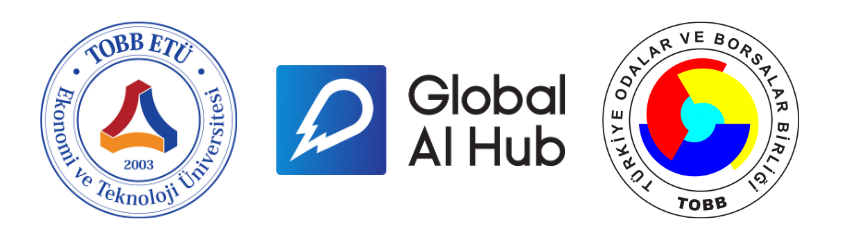

# Introduction to Artificial Intelligence 

Global AI Hub ekibi olarak TOBB ve TOBB ETÜ işbirliğinde düzenlediğimiz **“Introduction Machine Learning”** kursuna hoşgeldiniz!  Canlı ders bittikten sonra dersin bağlantısını kullanarak oturumları yeniden izleyebilirsiniz.  

Ders sonunda [Memnuniyet Anketimizi](https://forms.gle/DtK4mp7JgCucBDba9) doldurmayı unutmayınız!

## HATIRLATICILAR:  

- Sertifika almaya sorunsuz bir şekilde hak kazanabilmeniz için kurs süresi içerisinde katılım formunu doldurduğunuzdan lütfen emin olun. Katılım formu için lütfen [linke](https://forms.gle/W5fuDSfmsQaDbbg46) tıklayınız.   

- Katılım formu sadece kursun canlı olarak yapıldığı süre boyunca aktif olacaktır!  
- Lütfen katılım formunu doldururken sertifikanızın üzerinde görmek istediğiniz adınızı ve soyadınızı yazınız.  
- Her katılım formu doldururken aynı e-posta adresini kullanmaya dikkat ediniz.  

- Sertifika alabilmek için Global AI Hub topluluğuna [bu linkten](https://globalaihub.com/community/) üye olmalısınız.  
- Sorularınız ve ders notları için lütfen [bu linke](https://globalaihub.com/community-hubs/turkish-ai-hub/) tıklayınız. 

### Sertifika

### Linkler

### Ders icerikleri ve kaynaklari

   

